# One-axis stage to move a filter

This is a parametrizable open-source hardware (OSH) stage to move an optical filter. 
The dimensions of the filter and the stage are parametrizable in order to change the dimensions of the stage, the filter and any other components (stepper motor, belt tensioner, aluminum profiles,..)
The printable pieces are described using [FreeCAD](http://freecadweb.org/) Python scripts.
It can be compared with the OpenSCAD version: https://github.com/felipe-m/oscad_filter_stage

1. [Description](#description)
2. [Assembly](#assembly)
3. [Main parameters](#main_parameters)
    1. [Filter Holder Parameters](#filter_holder_param)
    2. [Belt Tensioner](#belt_tensioner_param)
4.  [Project organization](#directory)
5.  [Printable Parts](#printed_parts)

---

## Description <a name="description"></a>

The components of the stage are:
* Filter holder
* Timming belt
* Belt tensioner
* Stepper motor with pulley
* Motor holder
* Linear guide
* Some nuts and bolts

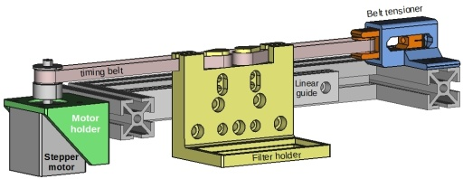

---

## Assembly <a name="assembly"></a>

### Filter holder

The filter holder holds an optical filter and it is attached to a linear guide. 

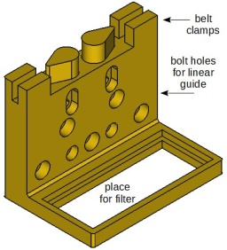


It has various holes to be able to fit in different linear guides

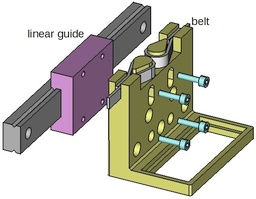


### Belt tensioner

The belt tensioner is composed by 2 printable parts, and idler pulley:
* Tensioner holder
* Idler tensioner
* Idler pulley
* Leadscrew with nut

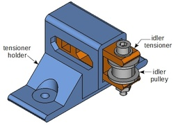

Back view of the belt tensioner:

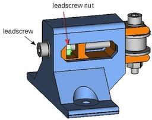

Exploded view of the belt tensioner:

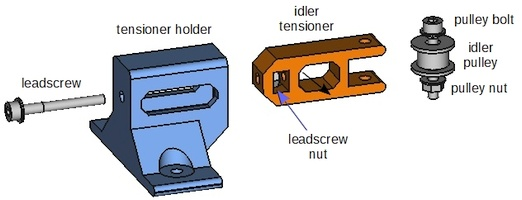

By turning the leadscrew, the idler pulley will retract or extend, tightening or loosening the belt. 

Retracted belt tensioner:

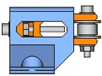

Extended belt tensioner:

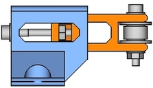

The idler pulley can be made out of a bearing, a bolt, a nut and some washers. 
For example, if using a DIN 912 bolt, it can be built this way:

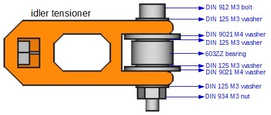

---

## Main Parameters <a name="main_parameters"></a>
Following, the main parameters are explained.
There are some other parameters that can be seen in the Python code.

---

### Filter Holder Parameters <a name="filter_holder_param"></a>


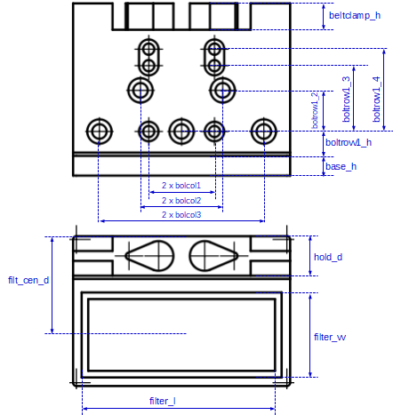

Example of 2 filter holders having different parameters:

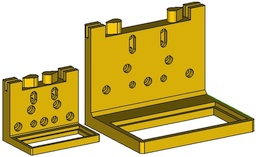

---

### Belt tensioner Parameters <a name="belt_tensioner_param"></a>


Idler tensioner size depending on the idler pulley:

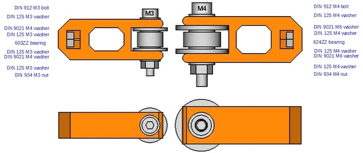

---

The tensioner stroke can be modified:

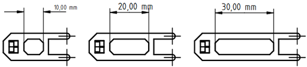

---

The thickness of the walls can be modified

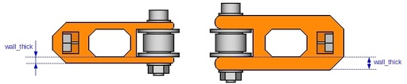

---

The metric size of the leadscrew can be modified:


---

These modifications lead to automatic modifications on the tensioner holder size:

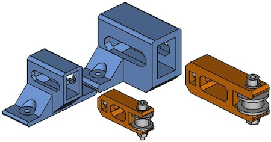

---

The belt height is parametrizable, leading to modifications on the tensioner holder:

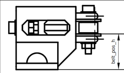

---

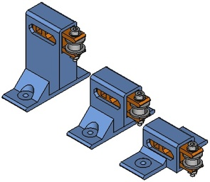


---

The base width, ie. the aluminum profile width, is parametrizable:

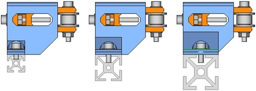


---

## Project organization <a name="directory"></a>
```
 +--- scr: Source files in Python
    +--- comps: functions in Python for FreeCAD, https://github.com/felipe-m/fcad-comps
 +--- freecad: Saved FreeCAD designs
 +--- stl: Parts exported to STL
 +--- imgs: Images of the 4 parts in png format
    +--- small: reduced size images
    +--- tens_hold_steps: images for the step by step explanation for the tensioer holder
    +--- idler_tens_steps: images for the step by step explanation for the idler tensioner
    +--- belt_tensioner: belt tensioner images
    +--- filter_holder: filter holder images
    +--- filter_stage: filter stage images
```

 comps: are python functions and classes to make the shapes easier. Check https://github.com/felipe-m/fcad-comps

---
 
## Step by step explanations <a name="printed_parts"></a>:
1. [idler_tensioner.md](./idler_tensioner.md) Detailed explanation for the idler tensioner

1. [tensioner_holder.md](./tensioner_holder.md) Detailed explanation for the tensioner holder


You can compare the same pieces designed using OpenSCAD: https://github.com/felipe-m/oscad_filter_stage

---

## Designs with no step by step explanations
1. The [tensioner_set.py](src/tensioner_set.py) module has no detailed explanation, but the code is explained based on the previous. This code combines the parts of the tensioner set and uses Python classes and methods.

1. [filter_holder_clss.py](src/filter_holder_clss.py) Filter holder, similar to the one made with OpenSCAD (https://github.com/felipe-m/oscad_filter_stage)

1. [filter_stage.py](src/filter_stage.py) In the same design includes the filter holder, the belt tensioner and the motor holder, and also some other non-printable models, such as the stepper motor, aluminum profile, linear guide, belt and pulleys


