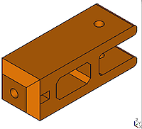
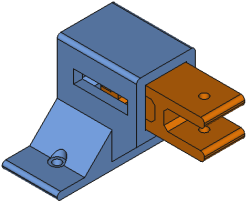
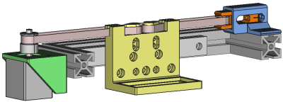

# One-axis stage to move a filter

Designed with Python scripts for [FreeCAD](http://freecadweb.org/) to compare with the OpenSCAD version:
https://github.com/felipe-m/oscad_filter_stage


```
 +--- scr: Source files in Python
    +--- comps: functions in Python for FreeCAD, https://github.com/felipe-m/fcad-comps
 +--- freecad: Saved FreeCAD designs
 +--- stl: Parts exported to STL
 +--- imgs: Images of the 4 parts in png format
    +--- small: reduced size images
    +--- tens_hold_steps: images for the step by step explanation for the tensioer holder
    +--- idler_tens_steps: images for the step by step explanation for the idler tensioner
```

 comps: are python functions and classes to make the shapes easier. Check https://github.com/felipe-m/fcad-comps


## Step by step explanations:
1. [idler_tensioner.md](./idler_tensioner.md) Detailed explanation for the idler tensioner

1. [tensioner_holder.md](./tensioner_holder.md) Detailed explanation for the tensioner holder


You can compare the same pieces made using OpenSCAD: https://github.com/felipe-m/oscad_filter_stage

## Designs with no step by step explanations
1. The [tensioner_set.py](src/tensioner_set.py) module has no detailed explanation, but the code is explained based on the previous. This code combines the parts of the tensioner set and uses Python classes and methods.

1. [filter_holder_clss.py](src/filter_holder_clss.py) Filter holder, similar to the one made with OpenSCAD (https://github.com/felipe-m/oscad_filter_stage)

1. [filter_stage.py](src/filter_stage.py) In the same design includes the filter holder, the belt tensioner and the motor holder, and also some other non-printable models, such as the stepper motor, aluminum profile, linear guide, belt and pulleys



