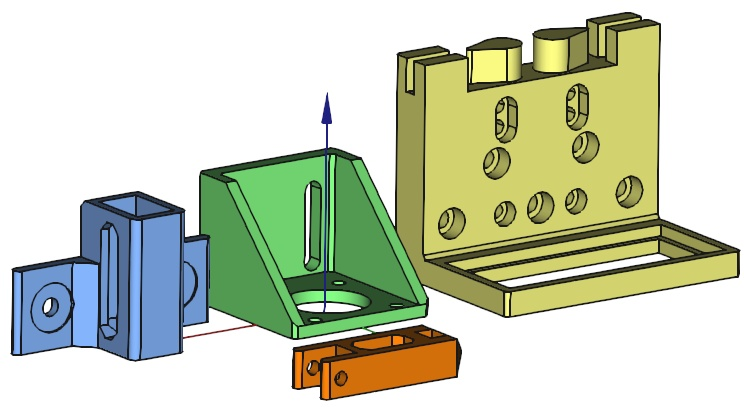
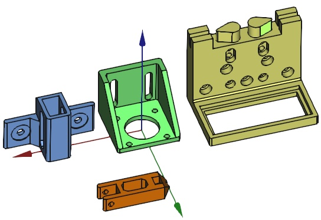

* [idler_tensioner.stl](idler_tensioner.stl) is the result of [idler_tensioner.py](../src/idler_tensioner.py)
* [tensioner_holder.stl](tensioner_holder.stl) is the result of [tensioner_holder.py](../src/tensioner_holder.py)
* [set_idler_tensioner.stl](set_idler_tensioner.stl) and [set_tensioner_holder.stl](set_tensioner_holder.stl) are the result of [tensioner_set.py](../src/tensioner_set.py)
* [class_idler_tensioner.stl](class_idler_tensioner.stl) and [class_tensioner_holder.stl](class_tensioner_holder.stl) are the result of [tensioner_clss.py](../src/tensioner_clss.py) used in the [filter stage example](../src/filter_stage.py).
* [filter_holder.stl](filter_holder.stl) is the result of [filter_holder_clss.py](../src/filter_holder_clss_clss.py) used in the [filter stage example](../src/filter_stage.py).
* [motor_holder.stl](motor_holder.stl) is a part of the same [filter stage example](../src/filter_stage.py).

---

## Print orientation

---

